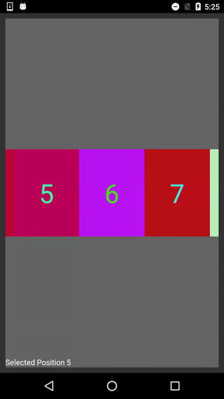
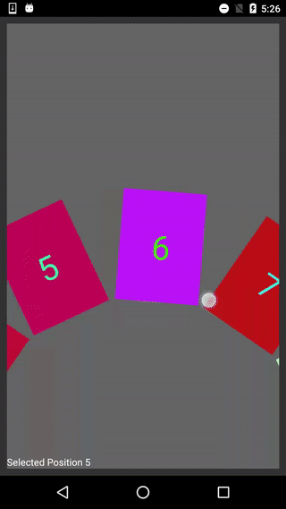
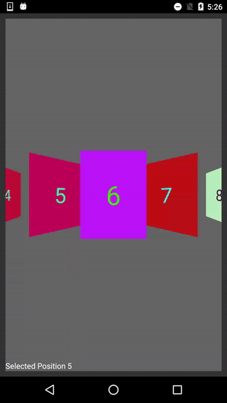
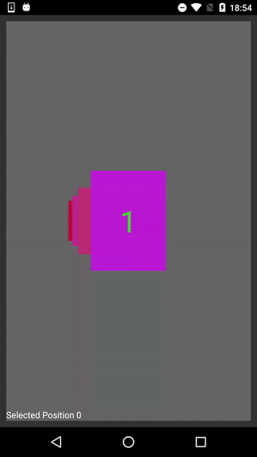
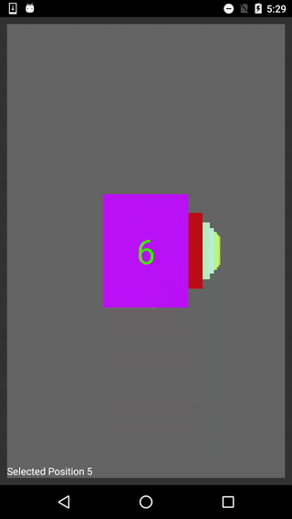
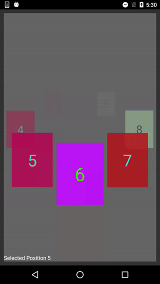
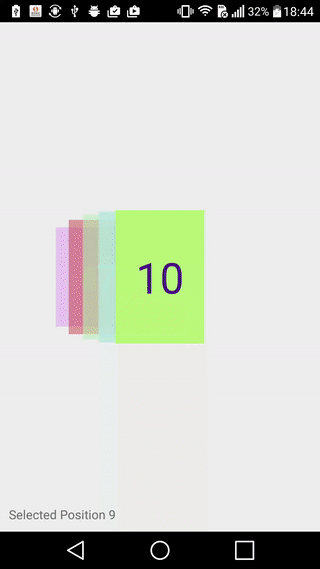
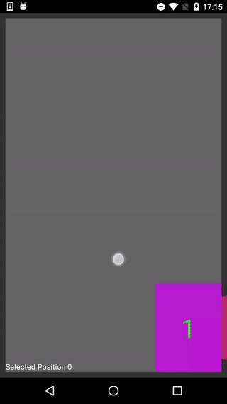

# Introduction

[](https://maven-badges.herokuapp.com/maven-central/com.gtomato.android.library/carouselview) [](https://bintray.com/gtomato/android-libraries/carouselview/_latestVersion)

CarouselView let you create fancy carousels effortlessly.

For example, to display a wheel carousel:

```java
carousel.setTransformer(new WheelViewTransformer());
carousel.setAdapter(new MyDataAdapter());
```

See below for effects of available built-in transformers.


# Features

## Transformations

### Built-in Transformations

#### Linear (`LinearViewTransformer`)



#### Wheel (`WheelViewTransformer`)



#### Cover Flow (`CoverFlowViewTransformer`)



#### Time Machine (`TimeMachineViewTransformer`)



#### Inversed Time Machine (`InverseTimeMachineViewTransformer`)



#### Flat Merry-go-round (`FlatMerryGoRoundTransformer`)



### Customize Built-in Transformations

Configure available options.

```java
CoverFlowViewTransformer transformer = new CoverFlowViewTransformer();
transformer.setYProjection(70f);
carousel.setTransformer(transformer);
```

Or, override transform to do more complex transformations.

```java
carousel.setTransformer(new WheelViewTransformer() {

    @Override
    public void transform(View view, float position) {
        super.transform(view, position)
        float alpha;
        if (-2 <= position && position <= 0) {
            alpha = (2 + position) / 2.0;
        } else if (0 < position && position <= 2) {
            alpha = (2 - position) / 2.0;
        } else {
            alpha = 0;
        }
        view.setAlpha(alpha);
    }
});
```

You may also want to to take a look at `ParameterizableViewTransformer`.

### Use Your Own Transformation

Implement `CarouselView.ViewTransformer`.

```java
carousel.setTransformer(new CarouselView.ViewTransformer() {
    @Override
    public void onAttach(CarouselLayoutManager layoutManager) {

    }

    @Override
    public void transform(View view, float position) {
        int width = view.getWidth(), height = view.getHeight();
        float alpha, transX, scale;
        if (-5 < position && position < 1) { // (-5, 1)
            if (position <= 0) { // (-5, 0]
                // position     -∞  ... -5      -4      -3      -2      -1      0
                // alpha        0   ... 0       0.2     0.4     0.6     0.8     1.0
                // transX       -∞  ... -1.0w   -0.8w   -0.6w   -0.4w   -0.2w   0w
                // scale        0   ... 0.5     0.6     0.7     0.8     0.9     1.0
                alpha = Math.max(0f, 1.0f + position * 0.2f);
                transX = position * width * 0.2f;
                scale = Math.max(0f, 1.0f - 0.4f * (float) Math.pow(position * 0.2, 2.0)); // s = 1 - 0.4 * (0.2p)^2
            } else /*if (position < 1) */ { // (0, 1)
                // position     0       0.5     1       ...     +∞
                // alpha        1.0     0.5     0       ...     0
                // transX       0pw     0.25pw  0.5pw   ...     +∞
                // scale        1.0     2.25    3.5     ...     +∞
                alpha = Math.max(0f, 1.0f - position);
                transX = position * carousel.getWidth() / 2;
                scale = 1.0f + position * 2.5f;
            }
            view.setAlpha(alpha);
            view.setTranslationX(transX);
            view.setScaleX(scale);
            view.setScaleY(scale);
            view.setVisibility(View.VISIBLE);
        } else { // (-∞, -5] | [1, +∞)
            // explicitly set visibility instead of alpha to improve performance
            view.setVisibility(View.GONE);
        }
    }
});
```

The display effect is as below:



## Alignment

Align the current view at center, bottom-left corner, or other corners as you wish.

```java
carousel.setGravity(Gravity.RIGHT | Gravity.BOTTOM);
```



## Infinite Looping

Infinite scrolling with finite data set.

```java
carousel.setInfinite(true);
```

## Behaviours

'Bounce' back to a view if user scrolls to midway between two adjacent views (default enabled).

```java
carousel.setScrollingAlignToViews(true);
```

Smooth scroll to somewhere distant.

```java
carousel.smoothScrollToPosition(carousel.getAdapter().getItemCount() - 1);
```

Listen to scroll position changes to do some wonderful actions. The centre view is 'selected'.

```java
carousel.setOnItemSelectedListener(new CarouselView.OnItemSelectedListener() {
  @Override
  public void onItemSelected(CarouselView carouselView, int position, int adapterPosition, RecyclerView.Adapter adapter) {
    lblSelectedIndex.setText("Selected Position " + position);
  }

  @Override
  public void onItemDeselected(CarouselView carouselView, int position, int adapterPosition, RecyclerView.Adapter adapter) {

  }
});
```

Listen to scroll events.

```java
carousel.setOnScrollListener(new CarouselView.OnScrollListener() {
    @Override
    public void onScrollEnd(CarouselView carouselView) {
        super.onScrollEnd(carouselView);
    }
});
```

Set `clipChildren` (and `clipToPadding`) to be false if you want to extend item views beyond bounds of `CarouselView`. You may need to set `extraVisibleChilds` to display properly and optimize memory usage.

```java
carousel.setClipChildren(false);
carousel.setExtraVisibleChilds(4);
```

Disable click itemview to scroll (default enabled).

```java
carousel.setClickToScroll(false);
```

Disable fast scrolling if necessary (default enabled).

```java
carousel.setEnableFling(false);
```


# Getting Started

## Install via Gradle

Include in module dependencies:
```groovy
compile 'com.gtomato.android.library:carouselview:<version>'
```

## Minimal Usage

Create CarouselView via layout XML or via code as usual.

```xml
<RelativeLayout xmlns:android="http://schemas.android.com/apk/res/android"
                android:layout_width="match_parent"
                android:layout_height="match_parent"
                android:padding="10dp">

    <com.gtomato.android.ui.widget.CarouselView
        android:id="@+id/carousel"
        android:layout_width="match_parent"
        android:layout_height="150dp"
        android:layout_centerInParent="true"/>

</RelativeLayout>
```

Implement your data adapter, e.g. `MyDataAdapter`, by extending `CarouselView.Adapter<VH>`.

```java
public static class MyDataAdapter extends CarouselView.Adapter<ViewHolder> {

    @Override
    public ViewHolder onCreateViewHolder(ViewGroup parent, int viewType) {
        MyView view = MyView.create(parent.getContext(), VIEW_WIDTH, VIEW_HEIGHT);
        return new ViewHolder(view);
    }

    @Override
    public void onBindViewHolder(ViewHolder holder, int position) {
        holder.getView().bind(position + 1);
    }

    @Override
    public int getItemCount() {
        return 10;
    }
}
```

Set any transformer you like, and bind data adapter to CarouselView.

```java
carousel.setTransformer(new FlatMerryGoRoundTransformer());
carousel.setAdapter(new MyDataAdapter());
```


# Other Resources

## Demo Project

Check out our demo project to see built-in transformations in action, how do configurations affect the visual effect, and how to implement.

## Javadoc

Check out the [javadoc](javadoc/) for all available APIs.


# Known Limitation

- CarouselView doesn't support itemviews with dynamic sizes yet. If dynamic size is needed, please wrap the itemview by a fixed-width container and adjust by custom transform as a workaround.
- Only horizontal scrolling is supported at this moment.


# FAQ

1. Migrating from CarouselView 1.0.x to 2.0

- Don't use `setDisplayMode`, use `setTransformer` instead. Go check out the new built-in `ViewTransformer` implementations
- Now calling `setTransformer` would replace current transformer and effect immediately upon next layout pass
- Now calling `setTransformer` would reset some options set on CarouselView, including scroller and drawOrder
- `CarouselView.DisplayOption` and `setDisplayOption` are removed. Call setter methods on transformers directly, e.g. `LinearViewTransformer#setOffsetXPercent(float)`
- Following methods are removed: `refreshDisplayMode`, `getDisplayOption`, `unsetDisplayOption`
- Added a new lifecycle method `onAttach` to `CarouselView.ViewTransformer` interface


# Roadmap

### 2.1

- Support dynamic itemview sizes by configuration
- Support vertical scrolling, and perhaps more (e.g. diagonal scrolling, circular scrolling, custom implementation, etc.)

### 2.2

- Either support latest version of RecyclerView or decouple from RecyclerView
- Provide more built-in transformations
- Replace DrawOrder by customizable Drawer

# Release Notes

### 2.0.1 (17 Sep, 2017)

- Fix itemviews are not re-measured after first inflation on layout pass
- Fix debug logging flag should be off by default

### 2.0.0 (3 Aug, 2017)

- Add new built-in transformation: Flat Merry-go-round
- Add Gravity
- Replace DisplayMode by Transformer for built-in transformations
- Replace DisplayOption by bean methods of Transformers

### 1.0.5 (31 Dec, 2015)

- Fix itemviews are not relayout if CarouselView#scrollToPosition(int) is called during layout process
- Remove a builtin transformation: TimeMachine
- Remove CarouselLayoutManager#setInverseScrollDirection(boolean)
- Add javadoc

### 1.0.4 (15 Oct, 2015)

- Fix OnItemSelectedListener is not triggered under fast scroll mode
- Remove ic_launcher.png
